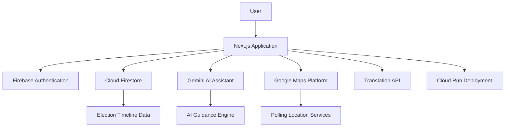

# 🗳️ VotePath AI — Understand Elections Clearly. Vote Confidently.


---

# 🌍 Overview

**VotePath AI** is a next-generation civic-tech platform designed to simplify the election process through AI-powered guidance, real-time timelines, multilingual accessibility, and intelligent voter assistance.

Built using the **Google Cloud Ecosystem**, the platform helps users:
- understand election timelines
- check eligibility
- prepare required documents
- locate polling stations
- navigate the voting journey step-by-step

with a primary focus on **India 🇮🇳** and the **United States 🇺🇸**.

---

## 🔗 Live Links

- 🌐 Live Platform: https://votepath-ai-873934402022.us-central1.run.app
- 💻 GitHub Repository: https://github.com/Akshatr08/votepath-ai

---

# ✨ Core Features

## 🤖 Gemini-Powered Election Assistant

An interactive AI assistant that provides:
- election guidance
- registration support
- eligibility clarification
- document requirements
- voting preparation help

### Powered By
- Gemini 2.0 Flash
- Google Generative AI SDK

---

## 🗺️ Smart Polling Locator

Locate nearby:
- polling booths
- voter registration centers
- election offices

with integrated mapping and geolocation intelligence.

### Powered By
- Google Maps Platform
- Places API
- Geocoding API

---

## 📈 Interactive Election Timeline

Track the complete election lifecycle:
- voter registration
- verification stages
- candidate filing
- polling dates
- result declarations

through animated, easy-to-understand workflows.

### Powered By
- Framer Motion
- Dynamic timeline engine

---

## 🛡️ Eligibility & Documentation Checker

Personalized election readiness engine that:
- validates voter eligibility
- checks required documents
- generates region-specific guidance
- adapts recommendations dynamically

### Powered By
- Rule-based workflow engine
- AI-assisted semantic validation

---

## 🌐 Multi-Language Accessibility

Supports multilingual election guidance for broader accessibility.

### Supported Languages
- English
- Hindi
- Bengali
- Tamil
- Telugu
- Marathi
- Gujarati
- Punjabi
- and more

### Powered By
- Google Cloud Translation API

---

# 🧭 Interactive Election Workflow

VotePath AI guides users through every stage of the voting journey:

1. Eligibility Verification  
2. Registration Process  
3. Document Validation  
4. Polling Preparation  
5. Voting Day Guidance  
6. Result Tracking  

This creates a personalized and easy-to-follow election experience.

---

# 🏗️ Technical Architecture



---

# 🛠️ Tech Stack

## Frontend
- Next.js 15+
- TypeScript
- Tailwind CSS
- Framer Motion

## Backend
- Firebase Authentication
- Cloud Firestore
- Next.js API Routes

## AI & Cloud
- Gemini 2.0 Flash
- Google Cloud Translation API
- Google Maps Platform
- Vertex AI (Planned Semantic Enhancements)

## Testing
- Vitest
- React Testing Library

## Infrastructure
- Docker
- Google Cloud Run

---

# ☁️ Google Services Integration

VotePath AI deeply integrates Google technologies for intelligence, scalability, and accessibility.

| Service | Purpose |
|---|---|
| Google Cloud Run | Scalable deployment |
| Gemini AI | Conversational election assistant |
| Firebase Firestore | Real-time election data |
| Firebase Authentication | Secure user access |
| Google Maps Platform | Polling station guidance |
| Translation API | Multi-language support |
| Vertex AI | Future semantic election workflows |

---

# 🧪 Quality Assurance

VotePath AI follows a security-first and testing-driven architecture.

## Testing
- Unit testing (Vitest & Testing Library)
- Integration testing
- API validation testing
- Security utility testing
- Eligibility workflow testing

**Status:** 284/284 Tests Passing (100% Coverage on core utilities)

## Security
- Rate limiting
- Input sanitization
- Hardened CSP headers
- Secure API handling

## Accessibility
- WCAG-inspired accessible components
- Keyboard navigation support
- ARIA labels
- Responsive design

## Performance
- Optimized rendering
- Efficient API workflows
- Lightweight modular architecture

---

# 🚀 Getting Started

## Prerequisites

- Node.js 18+
- Google Cloud Project
- Firebase Project

---

## Installation

### Clone Repository

```bash
git clone https://github.com/Akshatr08/votepath-ai.git
cd votepath-ai
```

### Install Dependencies

```bash
npm install
```

### Configure Environment Variables

Create a `.env.local` file using `.env.local.example`.

### Start Development Server

```bash
npm run dev
```

### Run Test Suite

Verify all 284+ tests are passing successfully:

```bash
npm run test
```

### Build for Production (Docker)

To deploy or test the production build locally via Docker:

```bash
docker build -t votepath-ai .
docker run -p 3000:3000 votepath-ai
```

---

# 📂 Project Structure

```bash
/src
  /app
  /components
  /services
  /utils
/tests
/public/screenshots
```

---

# 🛡️ Disclaimer

VotePath AI is a non-partisan educational platform.

We do not endorse any political party or candidate. Users should cross-check critical election information with official authorities such as:
- https://eci.gov.in
- https://vote.gov

---

# 🏁 Conclusion

VotePath AI demonstrates how AI and Google Cloud technologies can simplify civic participation by transforming complex election procedures into interactive, personalized, and accessible workflows.

---

Built with ❤️ for **PromptWars Hackathon**
